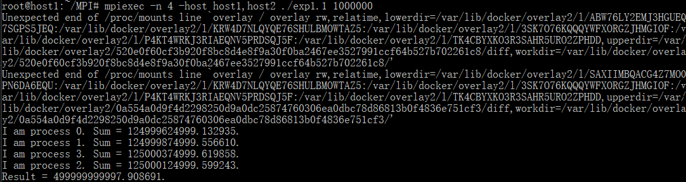
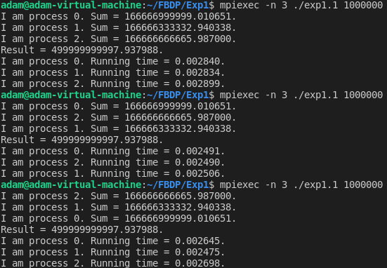

# Exp1
## 1. 用MPI_Reduce接口改写大数组各元素开平方求和
* data[N], data[i]=i*(i+1)
* 可通过命令行传入N的值，比如1000，10000，100000）
### 代码
```C
#include <stdio.h>
#include <stdlib.h>
#include <mpi/mpi.h>
#include <math.h>

int main(int argc, char **argv)
{
    int myid, numprocs, j;
    double sum = 0.0, result = 0.0;
    int N = atoi(argv[1]);
    long data[N], i;
    for (i = 0; i < N; i++)
    {
        data[i] = i * (i + 1);
    }
    MPI_Init(&argc, &argv);
    //MPI_Barrier(MPI_COMM_WORLD);
    double start = MPI_Wtime();
    MPI_Comm_rank(MPI_COMM_WORLD, &myid);
    MPI_Comm_size(MPI_COMM_WORLD, &numprocs);
    for (j = myid; j < N; j += numprocs)
    {
        sum += sqrt(data[j]);
    }
    printf("I am process %d. Sum = %f.\n", myid, sum);
    MPI_Reduce(&sum, &result, 1, MPI_DOUBLE, MPI_SUM, 0, MPI_COMM_WORLD);
    if (myid == 0)
    {
        printf("Result = %f.\n", result);
    }
    //MPI_Barrier(MPI_COMM_WORLD);
    double end = MPI_Wtime();
    MPI_Finalize();
    //printf("I am process %d. Running time = %f.\n", myid, end - start);
}
```
### 运行结果
  
### 问题及解决
#### mpicc编译时报错
   
在编译的时候在后面加上-lm,意思是链接到math函数库
    >  mpicc exp1.1.c -o exp1.1 -lm
#### mpicc编译时报错
  
报错是因为gcc基于c89标准，在gcc中直接在for循环中初始化增量语法在gcc中是错误的，必须先先定义i变量或换成C99标准
    >  mpicc exp1.1.c -o exp1.1 -lm -std=c99
#### mpiexec运行时出现未知消息
  
在docker中运行openmpi组件的bug，可以忽略  
可能是由于/ proc / mounts文件中包含大于512个字符的行,导致OpenMPI的hwloc模块无法正确解析它. Docker倾向于将非常长的行放入/ proc / mounts
### 思考
#### 程序运行时间(令N=1000000)  
在MPI_INIT后和MPI_Finalize前设置MPI_Barrier同步障  
在MPI_Barrier同步障后增加MPI_Wtime计时器  
```C
MPI_Init(&argc, &argv);
MPI_Barrier(MPI_COMM_WORLD);
double start = MPI_Wtime();
```
```C
MPI_Barrier(MPI_COMM_WORLD);
double end = MPI_Wtime();
MPI_Finalize();
printf("I am process %d. Running time = %f.\n", myid, end - start);
```
当n=1时  
  
running time 约为0.0065s  
当n=2时  
  
running time 约为0.0035s  
当n=3时  
  
running time 约为0.0025s  
当n=4时  
  
running time 约为0.0020s  
当n=5时  
  
running time 约为0.025s  
当n=6时  
  
running time 约为0.025s  
当进程数从1增加到3到4时，运行时间逐渐减少。  
当n大于等于5时，运行时间增加到n在1到4时运行时间的10倍并趋于稳定。
#### 数学公式猜想
=\frac{x^2}{2})
## 2. 用MPI_Send和MPI_Receive接口计算积分
* y=x^3，求其在[10,100]区间的积分
### 代码
```C
#define N 100000000
#define a 10
#define b 100
#include <stdio.h>
#include <stdlib.h>
#include <mpi/mpi.h>
int main(int argc, char **argv)
{
    int myid, numprocs, i, j;
    double dx = (double)(b - a) / N, x, d;
    double sum = 0.0, result = 0.0;
    MPI_Status status;
    MPI_Init(&argc, &argv);
    MPI_Comm_rank(MPI_COMM_WORLD, &myid);
    MPI_Comm_size(MPI_COMM_WORLD, &numprocs);
    for (i = myid; i < N; i = i + numprocs)
    {
        x = a + i * dx + dx / 2;
        sum += x * x * x * dx;
    }
    printf("I am process %d. Sum = %f.\n", myid, sum);
    if (myid != 0)
    {
        MPI_Send(&sum, 1, MPI_DOUBLE, 0, 99, MPI_COMM_WORLD);
    }
    else
    {
        result = sum;
        for (j = 1; j < numprocs; j++)
        {
            MPI_Recv(&d, 1, MPI_DOUBLE, j, 99, MPI_COMM_WORLD, &status);
            result += d;
        }
        printf("The integal of x*x in region [%d,%d] =%16.15f\n", a, b, result);
    }
    MPI_Finalize();
}
```
### 运行结果
  
### 思考
#### 程序运行时间
当程序在多节点运行时需要等待较长时间得出结果，猜测节点间的ssh通信速度慢增加了程序的运行时间。
#### 数学公式
