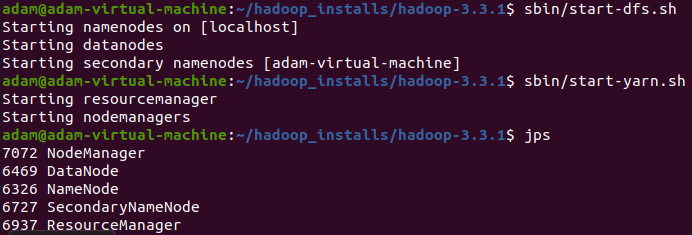
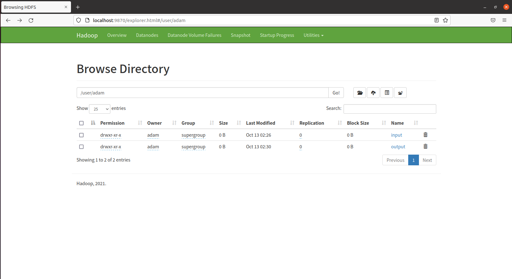
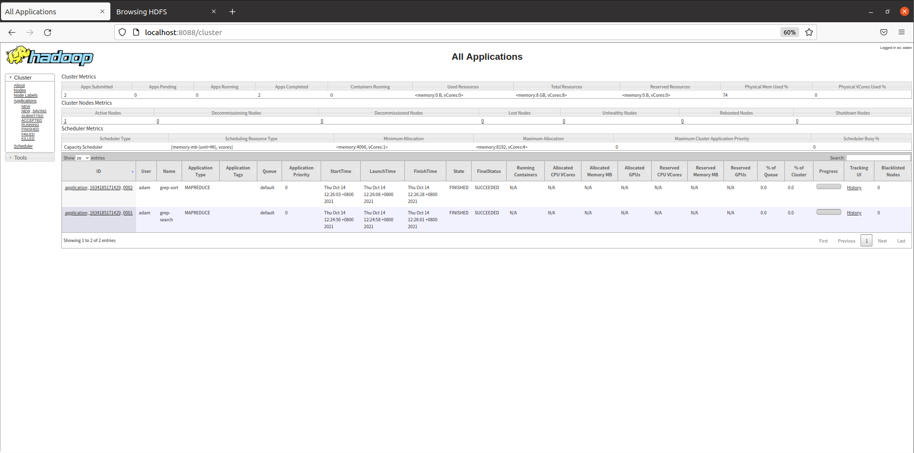
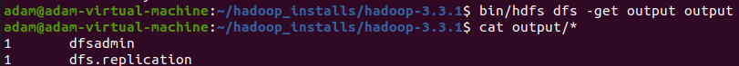
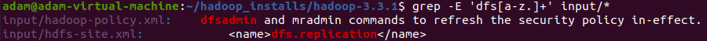
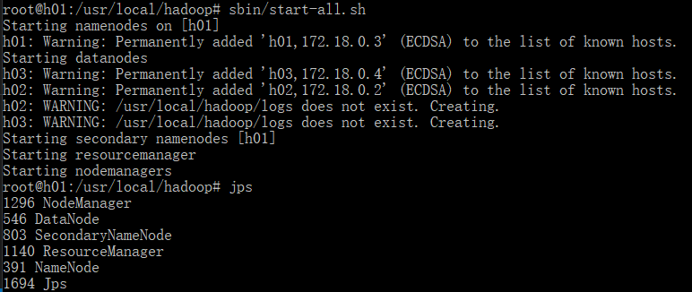
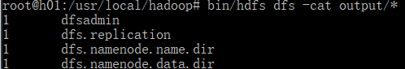
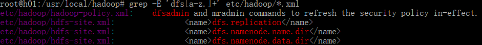

# Exp2
## 1. 伪分布模式安装和运行Hadoop
* 运行自带的MapReduce示例（Grep）
### 运行结果
* 集群状态  

* 检查输出
    * 准备输入  
        > $ cd /home/adamhadoop_installs/hadoop-3.3.1

        > $ mkdir input

        > $ cp etc/hadoop/*.xml input

        > $ bin/hdfs dfs -mkdir /user

        > $ bin/hdfs dfs -mkdir /user/adam

        > $ bin/hdfs dfs -mkdir /user/adam/input

        > $ bin/hdfs dfs -put input input

        > $ bin/hadoop jar share/hadoop/mapreduce/hadoop-mapreduce-examples-3.3.1.jar grep input output 'dfs[a-z.]+'
    * namenode web接口  
    
    * resourcemanager web接口  
    
    * mapreduce grep 输出结果  
    
    * linux grep 输出结果  
    -E 是扩展正则表达式  
    
### 问题及解决
* jdk安装  
    使用官网[Hadoop Java Versions](https://cwiki.apache.org/confluence/display/HADOOP/Hadoop+Java+Versions)推荐的openjdk8

    > Apache Hadoop 3.3 and upper supports Java 8 and Java 11 (runtime only)  
    Please compile Hadoop with Java 8. Compiling Hadoop with Java 11 is not supported  
    Now Apache Hadoop community is using OpenJDK for the build/test/release environment, and that's why OpenJDK should be supported in the community.  

    > $ sudo apt install openjdk-8-jdk
* namenode web接口直接操作文件发生错误
    > Permission denied: user=dr.who, access=WRITE, inode="/":adam:supergroup:drwxr-xr-x
    
    dr.who是hadoop中http访问的静态用户名，没有特殊含义，可以在./share/doc/hadoop/hadoop-project-dist/hadoop-common/core-default.xml中看到其配置:  
    > $ find -name core-default.xml

    > $ sudo vim core-default.xml

    > 切换到底线命令模式  
    :/staticuser.user

    ```xml
    <property>
        <name>hadoop.http.staticuser.user</name>
        <value>dr.who</value>
        <description>
            The user name to filter as, on static web filters while rendering content. An example use is the HDFS web UI (user to be used for browsing files).
        </description>
    </property>
    ```

    可以通过修改core-site.xml，配置为当前用户:
    ```xml
    <property>
        <name>hadoop.http.staticuser.user</name>
        <value>adam</value>
    </property>
    ```
* yarn执行MapReduce时找不到主类
    > Container exited with a non-zero exit code 1. Error file: prelaunch.err.  
    > Last 4096 bytes of prelaunch.err :  
    > Last 4096 bytes of stderr :  
    > 错误: 找不到或无法加载主类 org.apache.hadoop.mapreduce.v2.app.MRAppMaster

    可以在命令行输入
    > $ hadoop classpath

    然后把上述输出的值添加到yarn-site.xml文件对应的属性 yarn.application.classpath下面  
    ```xml
    <property>
        <name>yarn.application.classpath</name>
        <value>/home/adam/hadoop_installs/hadoop-3.3.1/etc/hadoop:/home/adam/hadoop_installs/hadoop-3.3.1/share/hadoop/common/lib/*:/home/adam/hadoop_installs/hadoop-3.3.1/share/hadoop/common/*:/home/adam/hadoop_installs/hadoop-3.3.1/share/hadoop/hdfs:/home/adam/hadoop_installs/hadoop-3.3.1/share/hadoop/hdfs/lib/*:/home/adam/hadoop_installs/hadoop-3.3.1/share/hadoop/hdfs/*:/home/adam/hadoop_installs/hadoop-3.3.1/share/hadoop/mapreduce/*:/home/adam/hadoop_installs/hadoop-3.3.1/share/hadoop/yarn:/home/adam/hadoop_installs/hadoop-3.3.1/share/hadoop/yarn/lib/*:/home/adam/hadoop_installs/hadoop-3.3.1/share/hadoop/yarn/*</value>
    </property>
    ```
## 2. 尝试集群模式（推荐基于Docker构建）安装和运行Hadoop
* 运行自带的MapReduce示例（Grep）
### 运行结果
* 集群状态  
  
* 检查输出
    * 准备输入  
        > $ cd /usr/local/hadoop

        > $ bin/hdfs dfs -mkdir /user

        > $ bin/hdfs dfs -mkdir /user/root

        > $ bin/hdfs dfs -mkdir /user/root/input

        > $ bin/hdfs dfs -put etc/hadoop/*.xml input

        > $ bin/hadoop jar share/hadoop/mapreduce/hadoop-mapreduce-examples-3.3.1.jar grep input output 'dfs[a-z.]+'
    * mapreduce grep 输出结果  
    
    * linux grep 输出结果  
    -E 是扩展正则表达式  
    
### 问题及解决
* 参考[知乎教程](https://zhuanlan.zhihu.com/p/59758201)操作，无明显问题